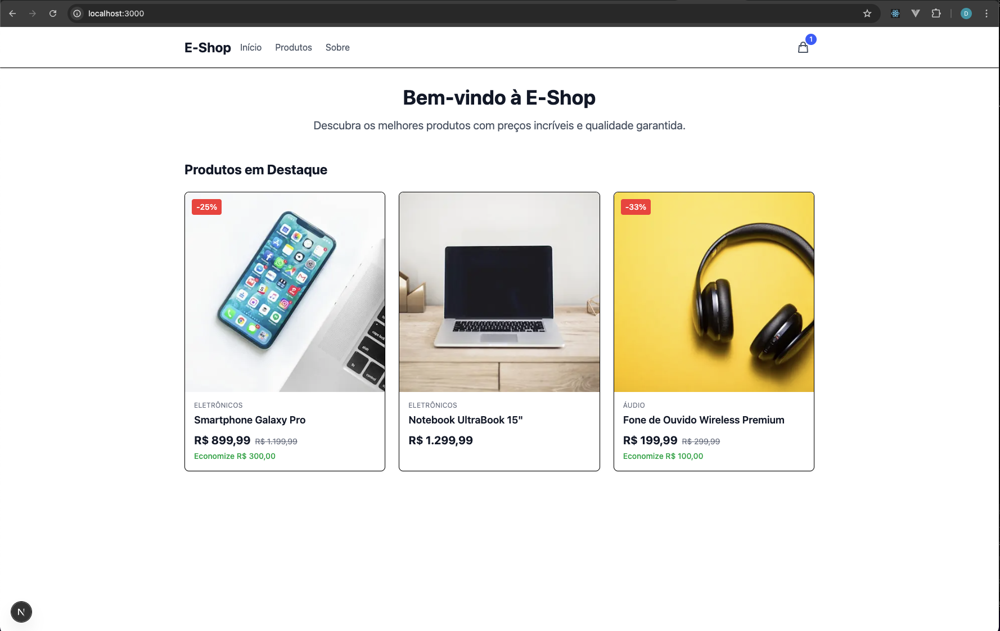

# 🛒 E-commerce Challenge

Sistema de e-commerce simples desenvolvido com Next.js e Node.js.

Demo: https://ecommerce-challenge-rnc7.vercel.app/



## 🎯 Sobre o Projeto

Implementação de um e-commerce com arquitetura moderna, focando em escalabilidade e experiência do usuário.

### Implementados ✅

**Frontend:**
- Página de produto com detalhes completos
- Carrinho de compras interativo
- Preços promocionais
- Interface responsiva

**Backend:**
- API REST completa
- Endpoints de produtos e carrinho
- Documentação Swagger

## 🚀 Diferenciais Implementados

### Além do Solicitado
- **Homepage com catálogo** completo de produtos
- **APIs extras**: listar produtos, atualizar quantidade, remover itens
- **Testes automatizados** com 100% de cobertura
- **Documentação interativa** com Swagger
- **Arquitetura escalável** com Clean Architecture

### Tecnologias Modernas
- **Next.js 15** + **React 19** (versões mais recentes)
- **TypeScript** com tipagem estrita
- **Tailwind CSS 4** para estilização
- **Zustand** para estado global
- **Jest** para testes

## 🛠️ Tecnologias

### Frontend
- Next.js 15 + React 19
- TypeScript + Tailwind CSS 4
- Zustand (estado global)

### Backend
- Node.js + Express + TypeScript
- Swagger (documentação)
- Jest (testes)

## 🚀 Como Executar

### Pré-requisitos
- Node.js 18+

### 1. Backend
```bash
cd backend
npm install
npm run dev     # http://localhost:3001
```

### 2. Frontend
```bash
cd frontend
npm install
npm run dev     # http://localhost:3000
```

### 3. Acessar
- **App**: http://localhost:3000
- **API Docs**: http://localhost:3001/api-docs

## 🧪 Testes

```bash
# Backend
cd backend
npm test

# Frontend
cd frontend
npm test
```

## 📚 API Endpoints

- `GET /api/products` - Lista produtos
- `GET /api/products/:id` - Detalhes do produto
- `GET /api/cart` - Carrinho do usuário
- `POST /api/cart/add` - Adicionar ao carrinho
- `PUT /api/cart/update` - Atualizar quantidade
- `DELETE /api/cart/remove/:id` - Remover item

## 🎯 Por Que Essas Escolhas?

**Simplicidade vs Demonstração:**
- Poderia ter feito mais simples (useState local, CSS básico, sem testes)
- Optei por mostrar conhecimento em arquitetura profissional
- Código preparado para produção e escalabilidade
- Padrões de mercado e boas práticas

## 📁 Estrutura

```
ecommerce-challenge/
├── backend/     # API Node.js
├── frontend/    # App Next.js
└── README.md
```

## 🔄 Funcionalidades

### ✅ Básicas (Requisitos)
- Página de produto
- Carrinho de compras
- API backend

### 🎁 Extras (Diferenciais)
- Catálogo na homepage
- Testes completos
- Documentação Swagger
- Arquitetura escalável
- UX moderna
